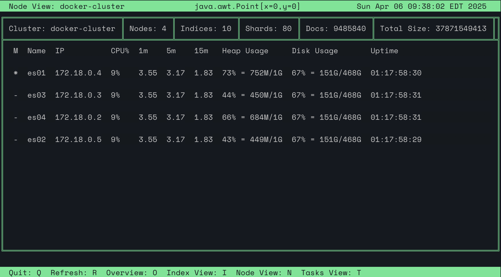
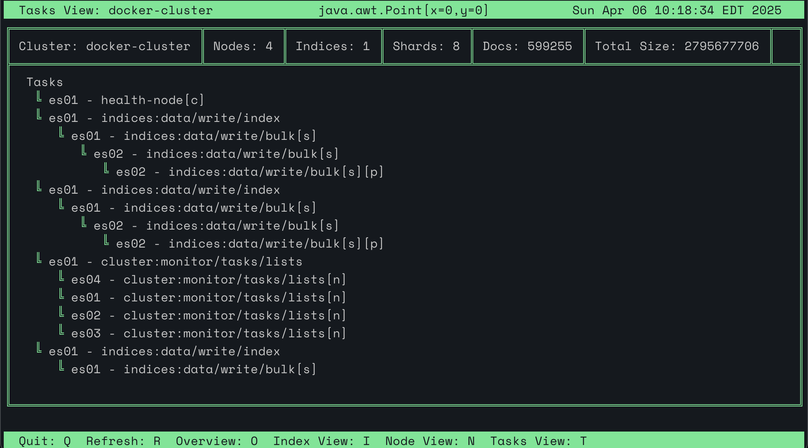
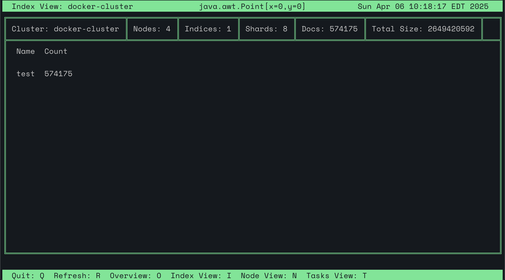

# ElasticSearchCli

ElasticSearchCli is a command-line interface (CLI) tool designed to interact with Elasticsearch clusters. It simplifies various operations, allowing users to manage and query their Elasticsearch instances directly from the terminal.

## Features

- **Cluster Management:** Monitor and manage cluster health, nodes, and indices.
- **Search Functionality:** Execute complex search queries and aggregations.
- **Configuration Management:** Manage cluster settings and configurations.

## Prerequisites

Before using ElasticSearchCli, ensure that you have the following installed:

- **Java Development Kit (JDK):** ElasticSearchCli is built with Java, so a compatible JDK is required.
- **Elasticsearch Cluster:** Access to a running Elasticsearch cluster.

## Installation

To build and install ElasticSearchCli from source:

1. **Clone the Repository:**

   ```bash
   git clone https://github.com/oblodgett/ElasticSearchCli.git
   ```

2. **Navigate to the Project Directory:**

   ```bash
   cd ElasticSearchCli
   ```

3. **Build the Project:**

   Use Maven to build the project. The `pom.xml` file is provided in the repository.

   ```bash
   mvn clean package
   ```

4. **Run the CLI:**

   After building, you can run the CLI tool using:

   ```bash
   ./escli
   ```

## Usage

Once the CLI is running, you can execute various commands to interact with your Elasticsearch cluster. For example:

- **Modify Cluster Config:**

```bash
> cluster set cluster.property somevalue
> cluster get cluster.property
```

- **Generate Random Cluster Documents:**

```bash
> cluster generate indexName docAmount threads
```

- **Check Cluster Health:**

```bash
> cluster info
> cluster nodes
```

- **Indices Operations:**

```bash
> index list
> index info
> index switchalias indexName oldAlias newAlias
> index delete indexName
```

- **Configure the Client:**

```bash
> config set name value
> config get name
> config print
> config load file
> config save file
```

- **Elastic Search TOP:**

```bash
> estop
```

[](images/NodeView.png)

[](images/TaskView.png)

[](images/IndexView.png)

For a full list of commands and their usage, refer to the `help` command within the CLI:

```bash
help
```

## Configuration

ElasticSearchCli can be configured using a configuration file or environment variables. By default, it looks for a configuration file at `$HOME/.elasticsearch-cli/config.json`. You can specify cluster aliases, authentication credentials, and other settings in this file.

Example `config.json`:


```json
{
  "clusters": {
    "default": {
      "host": "http://localhost:9200",
      "user": "your_username",
      "pass": "your_password"
    }
  }
}
```

Alternatively, you can set environment variables such as `ES_HOST`, `ES_USER`, and `ES_PASS` to configure the CLI.

## Contributing

Contributions to ElasticSearchCli are welcome. To contribute:

1. **Fork the Repository:**

   Click on the "Fork" button at the top right of the repository page.

2. **Create a New Branch:**

   ```bash
   git checkout -b feature/your-feature-name
   ```

3. **Make Your Changes:**

   Implement your feature or fix the identified issue.

4. **Commit Your Changes:**

   ```bash
   git commit -m "Description of your changes"
   ```

5. **Push to Your Fork:**

   ```bash
   git push origin feature/your-feature-name
   ```

6. **Submit a Pull Request:**

   Navigate to the original repository and click on "New Pull Request" to submit your changes for review.

## License

ElasticSearchCli is licensed under the MIT License. See the `LICENSE` file for more details.

## Acknowledgments

Special thanks to all contributors and the broader Elasticsearch community for their support and contributions.

---

*Note: This README is a template and may require updates to accurately reflect the current state of the ElasticSearchCli project. Please refer to the project's source code and documentation for the most up-to-date information.*
